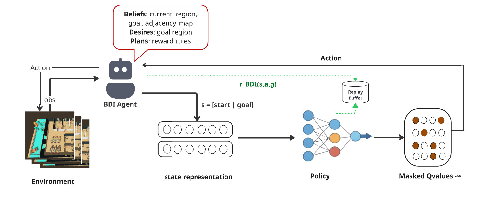
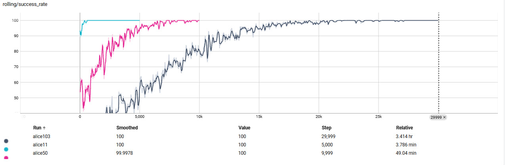

# VEsNA with Reinforcement Learning

This repository implements a hybrid **BDI + RL** navigation system where an agent learns shortest-path behavior in an office graph.

## Table of Contents

- [1.0 Abstract](#10-abstract)
- [1.1 Mathematical Notion](#11-mathematical-notion)
- [1.2 Introduction](#12-introduction)
- [2.0 Literature Review](#20-literature-review)
- [2.1 Background](#21-background)
- [2.2 Related Works](#22-related-works)
- [3.0 Methodology](#30-methodology)
- [3.1 Architecture](#31-architecture)
- [3.2 Design Choices](#32-design-choices)
- [4.0 Experiments](#40-experiments)
- [4.1 Installation and `.venv` Placement](#41-installation-and-venv-placement)
- [4.2 How to Run NOVAE Experiments](#42-how-to-run-novae-experiments)
- [4.3 Discussion](#43-discussion)
- [4.4 Future Work](#44-future-work)
- [5.0 Conclusion](#50-conclusion)
- [6.0 Table of References](#60-table-of-references)

## 1.0 Abstract

VEsNA combines symbolic reasoning and deep reinforcement learning for goal-conditioned navigation.  
The system is split across three layers: **Godot** (world/body), **JaCaMo/Jason** (BDI reasoning and reward logic), and **Python DQN** (policy learning).  
The agent learns a reusable navigation policy over multiple room maps (11, 50, and 103 regions).



### 1.1 Mathematical Notion

We model navigation as a goal-conditioned Markov Decision Process:

- State: $s_t = [\mathrm{onehot(current)} \,\|\, \mathrm{onehot(goal)}] \in \{0,1\}^{2N}$
- Action: $a_t \in \mathcal{A}(s_t)$, restricted to valid neighboring regions
- Reward:
  - $+100$ on goal
  - $-1$ per step
  - $-10$ on timeout
- Objective: maximize discounted return $\mathbb{E}[\sum_t \gamma^t r_t]$


DQN update:
$$
y_t = r_t + \gamma \max_{a'} Q_{\theta^-}(s_{t+1}, a'), \quad
\theta \leftarrow \arg\min_\theta \left(Q_\theta(s_t, a_t) - y_t\right)^2
$$

### 1.2 Introduction

Classical planners are interpretable but brittle under uncertainty; pure RL adapts well but lacks symbolic structure.  
This project uses a hybrid approach:

- Jason handles goals, episode control, and symbolic map reasoning.
- Python DQN handles value learning and action selection.
- Godot executes movement and perception feedback.

The result is a modular system where reasoning and learning remain decoupled but cooperative.

## 2.0 Literature Review

### 2.1 Background

The project sits at the intersection of:

- **Behavioral decision making (BDI agents)** for symbolic goals and plans.
- **Deep Q-Learning** for discrete action-value learning.
- **Goal-conditioned RL** for generalization across start-goal pairs.

### 2.2 Related Works

- **DQN** introduced stable deep value learning with replay and target networks [1].
- **UVFA** formalized value functions conditioned on goals [2].
- **Domain randomization** showed that randomized training improves robustness [3].
- **HER** improved sparse-goal learning via relabeling failed trajectories [4].

## 3.0 Methodology

### 3.1 Architecture

| Layer | Responsibility | Main location |
| --- | --- | --- |
| Godot | Physical simulation, movement, perception | `env/office/` |
| JaCaMo/Jason | Reward machine, episode manager, symbol↔number bridge | `mind/src/agt/` |
| Python DQN | Replay buffer, policy net, training/inference API | `mind/python/` |


Communication pattern:

1. Jason encodes `(current, goal)` and valid actions.
2. Java bridge sends HTTP request to Python (`/select_action`).
3. Python returns `action_id`.
4. Jason decodes action and commands movement in Godot.

### 3.2 Design Choices

1. **Goal-conditioned state encoding**: one network handles many navigation tasks.
2. **Action masking**: illegal transitions are blocked before argmax.
3. **Replay + target network**: stabilizes Q-learning.
4. **Layered ownership**: Jason owns semantics/rewards, Python owns optimization.
5. **Scalable map modes**:
   - 11 regions (`runNavigationRL11`)
   - 50 regions (`runNavigationRL50`)
   - 103 regions (`runNavigationRL103`)

## 4.0 Experiments

### 4.1 Installation and `.venv` Placement

For this **NOVAE paper implementation**, the Python virtual environment must be created at:

`mind/python/.venv/`

The startup scripts (`start_navigation_training.sh`, `start_all.sh`, `launch_tensorboard.sh`) look for Python exactly there.

Prerequisites:

- Python 3.10+
- JDK 17 (project includes `mind/jdk-17.0.13+11`)
- Bash + `curl` (Git Bash on Windows is fine)

Setup commands:

```bash
cd mind/python
python -m venv .venv
source .venv/Scripts/activate   # Windows (Git Bash)
# source .venv/bin/activate     # Linux/macOS
pip install -r requirements.txt
pip install matplotlib plotly networkx
```

### 4.2 How to Run NOVAE Experiments

Main experiment launcher (graph-based training, no Godot required):

```bash
./start_navigation_training.sh --small    # 11 regions  -> checkpoints/alice11.pt
./start_navigation_training.sh --medium   # 50 regions  -> checkpoints/alice50.pt
./start_navigation_training.sh --large    # 103 regions -> checkpoints/alice103.pt
```

Artifacts produced:

- Checkpoints: `checkpoints/alice11.pt`, `checkpoints/alice50.pt`, `checkpoints/alice103.pt`
- Service logs: `logs/dqn_server_11.log`, `logs/dqn_server_50.log`, `logs/dqn_server_103.log`
- TensorBoard logs: `runs/alice11/`, `runs/alice50/`, `runs/alice103/`

Run mission execution (uses trained 50-region policy):

```bash
./start_mission.sh
```

Run evaluation for the paper:

```bash
python evaluate_policy.py --checkpoint checkpoints/alice50.pt
python eval_console.py
python eval_interactive_plots.py
```

Optional monitoring:

```bash
python plot_training.py
python csv_to_tensorboard.py
tensorboard --logdir runs --port 6006
```

Core evaluation protocol:

1. Load a trained checkpoint (e.g., `checkpoints/alice50.pt`).
2. Evaluate all start-goal pairs (50x49 = 2450 pairs for the 50-region map).
3. Compare agent path length against BFS shortest-path baseline.
4. Report success rate, average steps, and optimality ratio.




### 4.3 Discussion

The hybrid architecture is practical: symbolic modules enforce task structure while DQN learns navigation behavior from experience.  
All-pairs evaluation against BFS provides a strict sanity check on policy quality and generalization.

### 4.4 Future Work

1. Integrate HER for faster sparse-goal learning.
2. Add curriculum learning from small to large maps.
3. Extend to dynamic obstacles and partial observability.
4. Explore transfer from simulated maps to real robot navigation tasks.

## 5.0 Conclusion

VEsNA demonstrates that BDI reasoning and deep RL can be combined cleanly for reusable navigation policies.  
The current implementation supports training, mission execution, and reproducible evaluation across multiple environment scales.

## 6.0 Table of References

| ID | Reference |
| --- | --- |
| [1] | Mnih, V. et al. (2015). *Human-level control through deep reinforcement learning*. Nature. |
| [2] | Schaul, T., Horgan, D., Gregor, K., Silver, D. (2015). *Universal Value Function Approximators*. ICML. |
| [3] | Tobin, J. et al. (2017). *Domain Randomization for Transferring Deep Neural Networks from Simulation to the Real World*. IROS. |
| [4] | Andrychowicz, M. et al. (2017). *Hindsight Experience Replay*. NeurIPS. |
| [5] | Sutton, R. S., Barto, A. G. (2018). *Reinforcement Learning: An Introduction* (2nd ed.). MIT Press. |
