# Deep Reinforcement Learning as a Service - VEsNA Architecture

## Author: Zahra Daoui
## Project: NOVAE VEsNA Learning

---

## Table of Contents

1. [Overview](#1-overview)
2. [System Architecture](#2-system-architecture)
3. [Encoding and Decoding](#3-encoding-and-decoding)
4. [Action Masking (KB Constraints)](#4-action-masking-kb-constraints)
5. [The Complete Flow](#5-the-complete-flow)
6. [Code Reference](#6-code-reference)
7. [Key Design Decisions](#7-key-design-decisions)

---

## 1. Overview

This system implements **Deep Reinforcement Learning as a Service (DRLaaS)** where:

- A **BDI agent (Jason)** handles symbolic reasoning, domain knowledge, and reward computation
- An **external Python service** handles neural network learning (DQN)
- They communicate via **HTTP REST API**

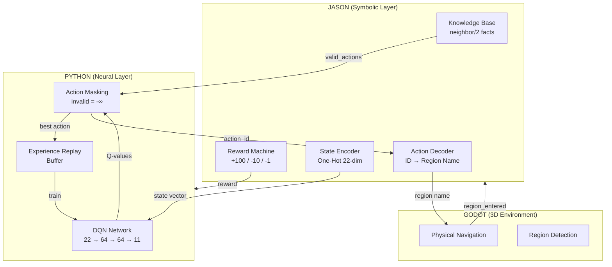

---

## 2. System Architecture

### 2.1 High-Level Architecture

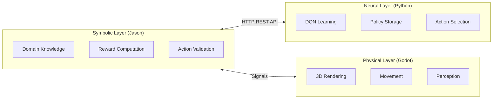

### 2.2 The Office Environment (11 Regions)

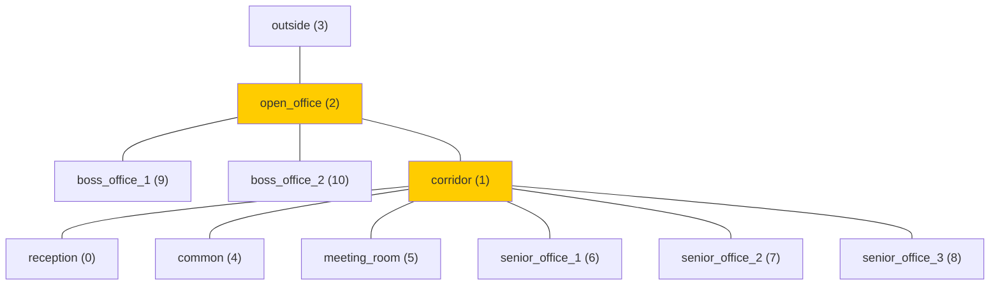

### 2.3 Knowledge Base (KB) - Adjacency Facts

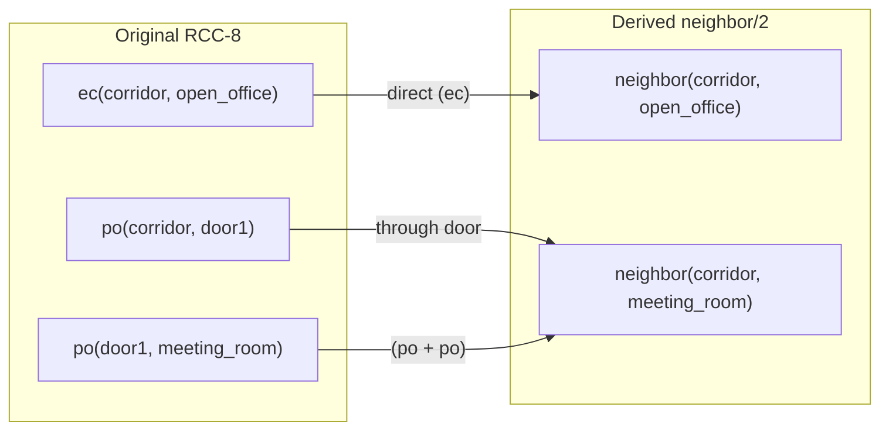

---

## 3. Encoding and Decoding

### 3.1 Two Types of Encoding

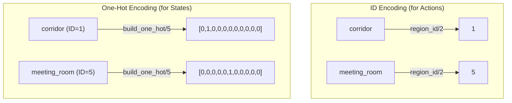

### 3.2 Goal-Conditioned State (22-dim)

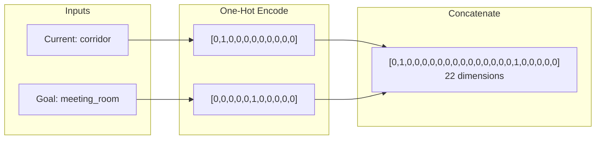

### 3.3 Encoding/Decoding Flow

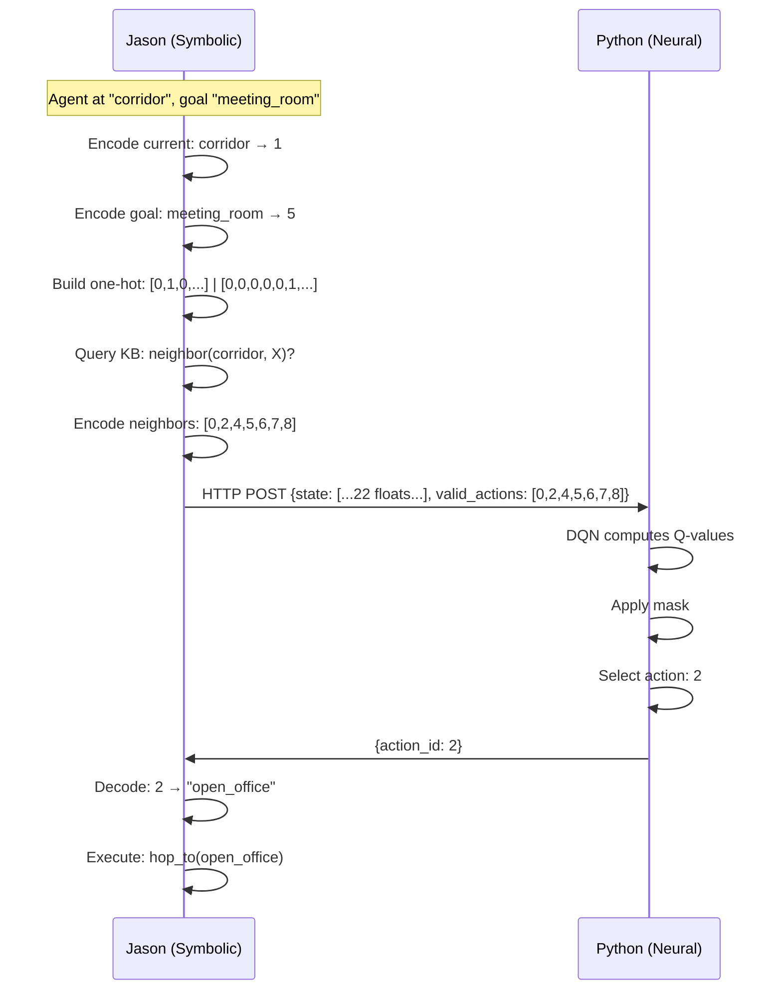

---

## 4. Action Masking (KB Constraints)

### 4.1 The Masking Process

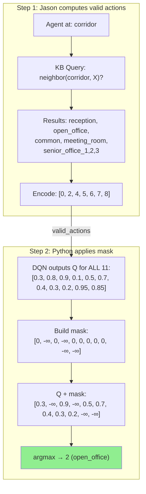

### 4.2 Masking Visualization

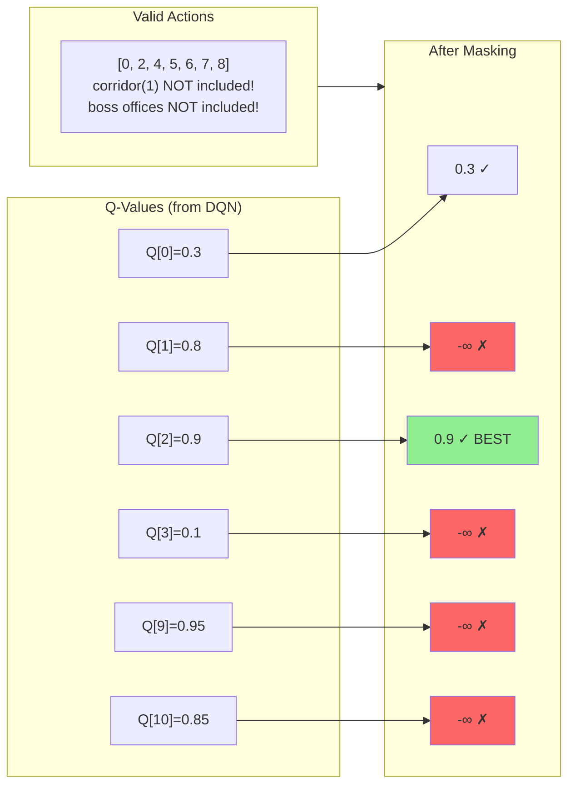

### 4.3 Why Mask in Python?

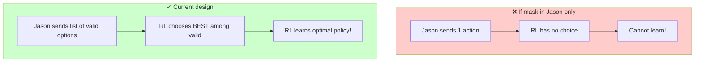

---

## 5. The Complete Flow

### 5.1 One RL Step (Sequence Diagram)

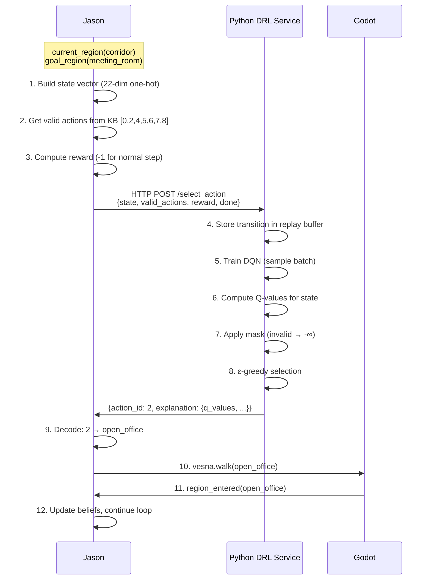

### 5.2 Episode Lifecycle

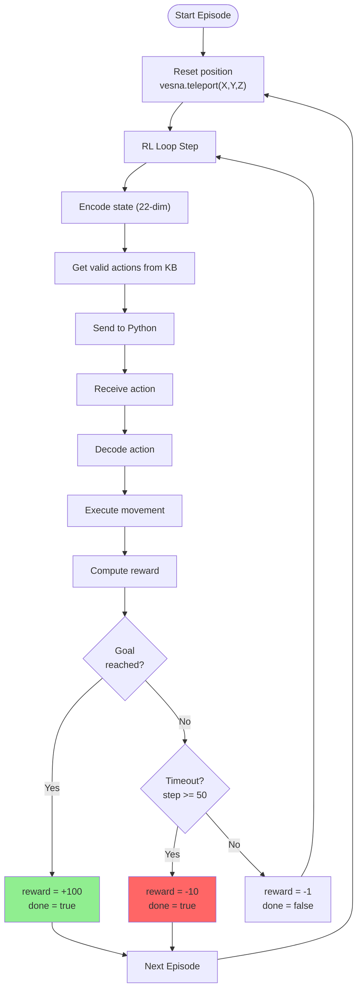

### 5.3 Reward Machine Logic

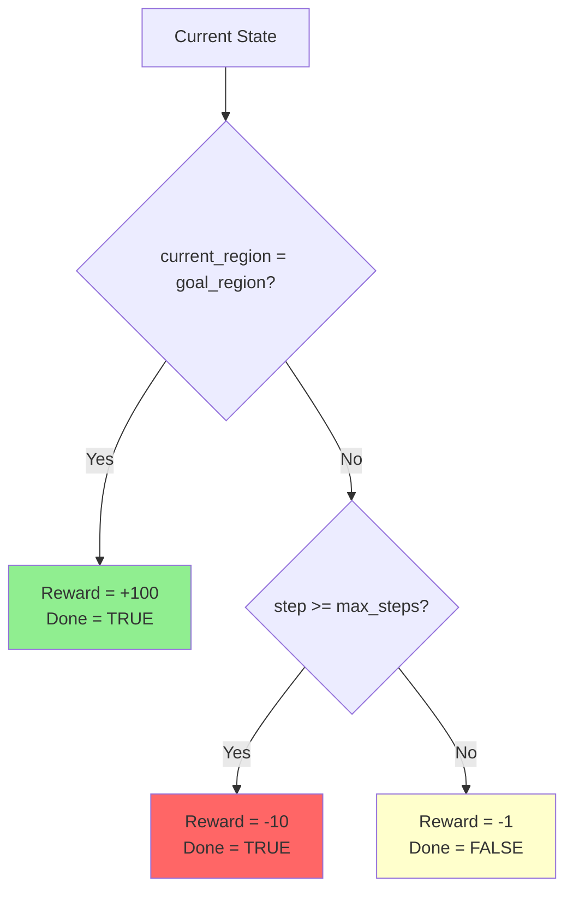

### 5.4 Training vs Inference

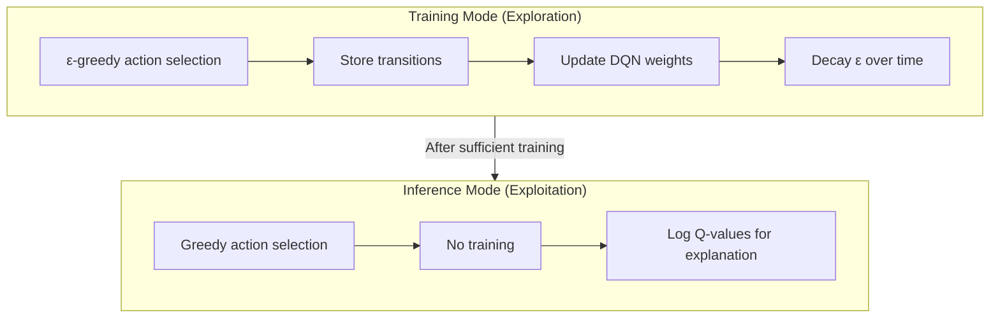

---

## 6. Code Reference

### 6.1 File Structure

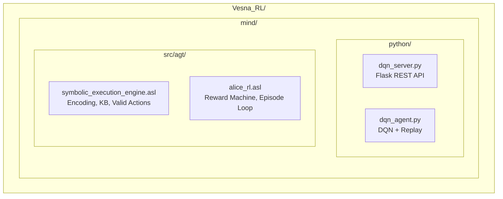

### 6.2 Key Functions Map

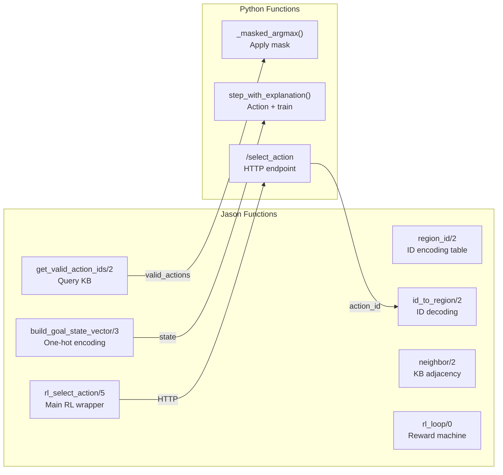

### 6.3 Function Details

| Function | File:Line | Purpose |
|----------|-----------|---------|
| `region_id/2` | symbolic_execution_engine.asl:25-35 | ID encoding table |
| `id_to_region/2` | symbolic_execution_engine.asl:40 | ID decoding |
| `neighbor/2` | symbolic_execution_engine.asl:49-77 | KB adjacency facts |
| `build_goal_state_vector/3` | symbolic_execution_engine.asl:89-93 | One-hot state encoding |
| `get_valid_action_ids/2` | symbolic_execution_engine.asl:112-114 | Query KB for valid actions |
| `rl_select_action/5` | symbolic_execution_engine.asl:127-135 | Main RL call wrapper |
| `rl_loop/0` | alice_rl.asl:66-116 | Reward machine + episode loop |
| `_masked_argmax()` | dqn_agent.py:120-123 | Apply mask to Q-values |
| `step_with_explanation()` | dqn_agent.py:154-220 | Action selection + training |
| `/select_action` | dqn_server.py:75-150 | HTTP endpoint |

---

## 7. Key Design Decisions

### 7.1 Separation of Concerns

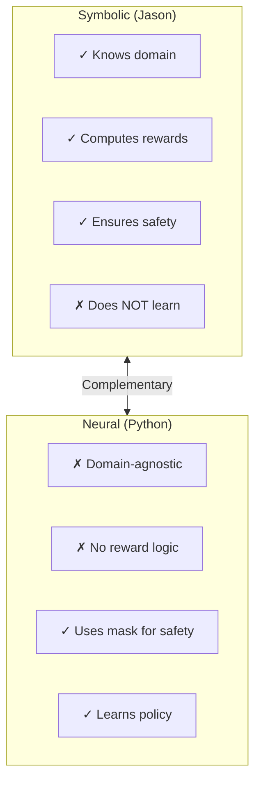

### 7.2 Why Goal-Conditioned State?

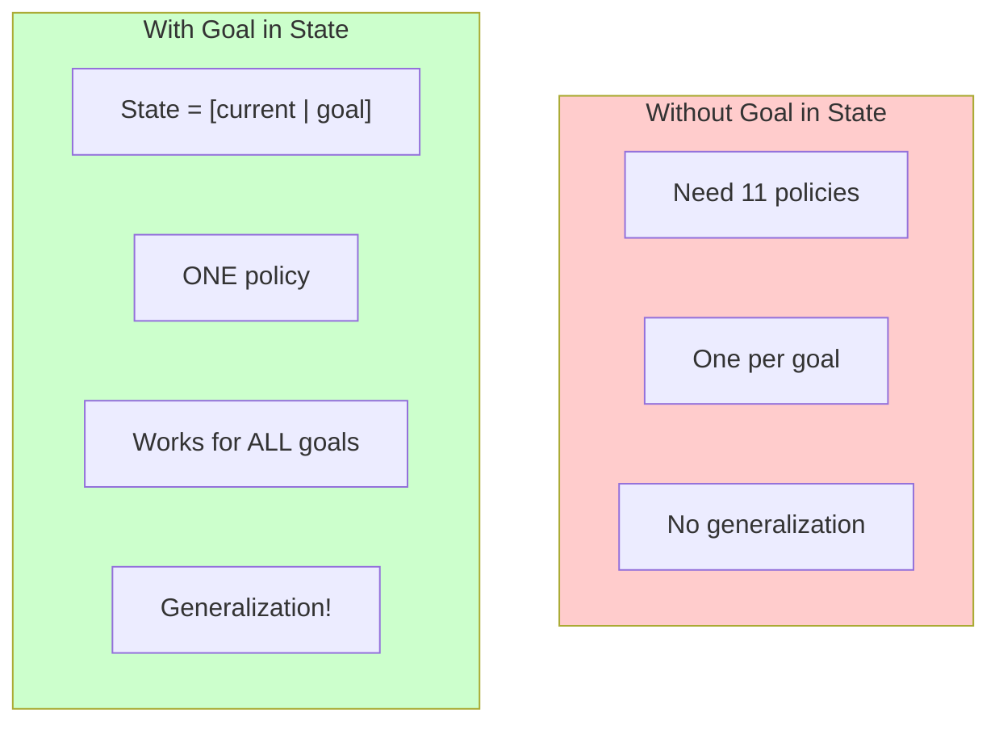

### 7.3 Benefits of Action Masking

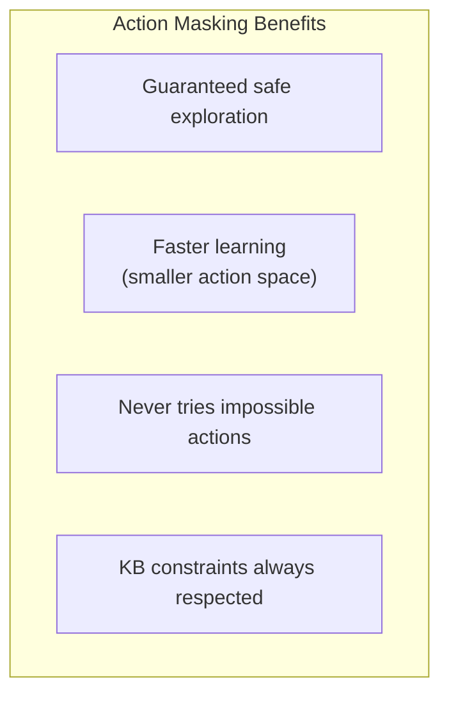

### 7.4 Why Reward Machine in Symbolic Layer?

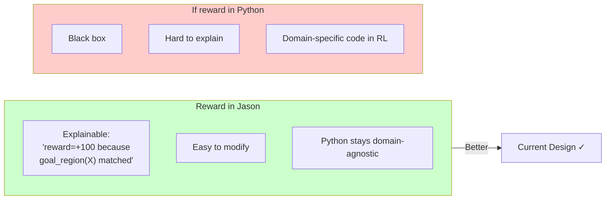

---

## Summary Architecture

```mermaid
flowchart TB
    subgraph NEURO_SYMBOLIC["NEURO-SYMBOLIC RL ARCHITECTURE"]
        subgraph SYM["SYMBOLIC (Jason)"]
            KB["KB Constraints<br/>neighbor(X,Y)"]
            RM["Reward Machine<br/>+100/-10/-1"]
            ENC["State Encoder<br/>[curr|goal] 22-dim"]
            DEC["Action Decoder<br/>2 → open_office"]
        end

        subgraph NEU["NEURAL (Python)"]
            DQN["DQN Network<br/>22→64→64→11"]
            MASK["Action Masking<br/>invalid = -∞"]
            REPLAY["Experience<br/>Replay Buffer"]
        end
    end

    KB -->|"valid_actions"| MASK
    ENC -->|"state"| DQN
    DQN -->|"Q-values"| MASK
    MASK -->|"train"| REPLAY
    REPLAY -->|"batch"| DQN
    MASK -->|"action_id"| DEC
    RM -->|"reward"| REPLAY

    style KB fill:#E8F5E9
    style RM fill:#E8F5E9
    style ENC fill:#E8F5E9
    style DEC fill:#E8F5E9
    style DQN fill:#E3F2FD
    style MASK fill:#E3F2FD
    style REPLAY fill:#E3F2FD
```

---

## Key Insight

> **Symbolic knowledge (KB, rewards) constrains and guides neural learning, while the neural network handles the complexity of finding optimal policies within those constraints.**

This neuro-symbolic approach combines:
- **Safety** from symbolic constraints
- **Flexibility** from neural learning
- **Explainability** from symbolic reward computation
